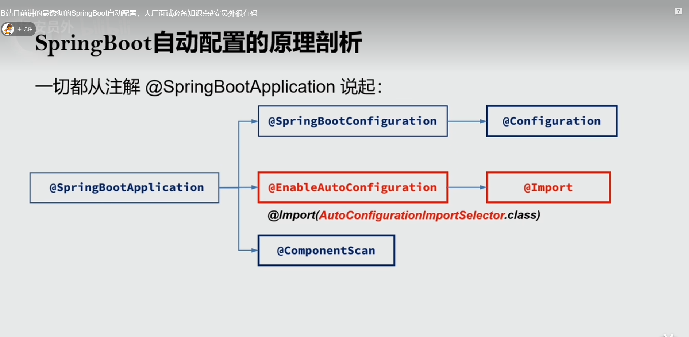
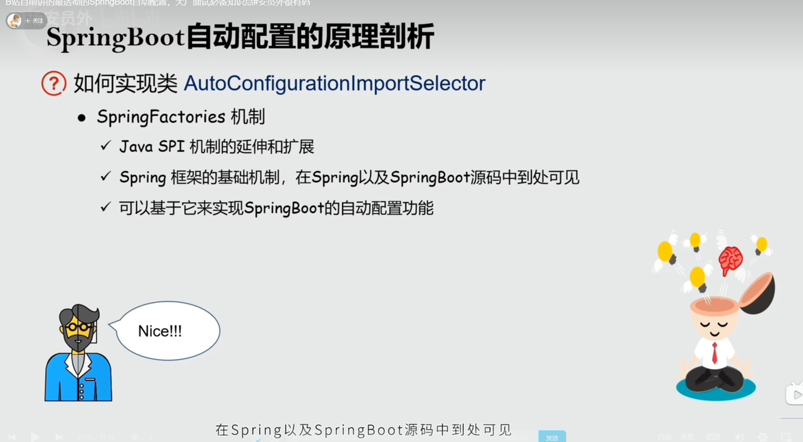
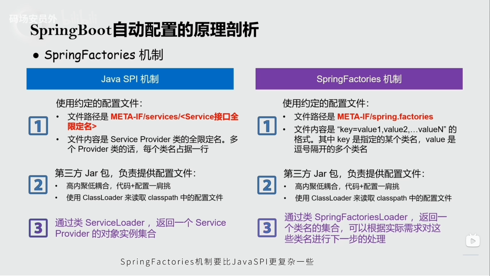
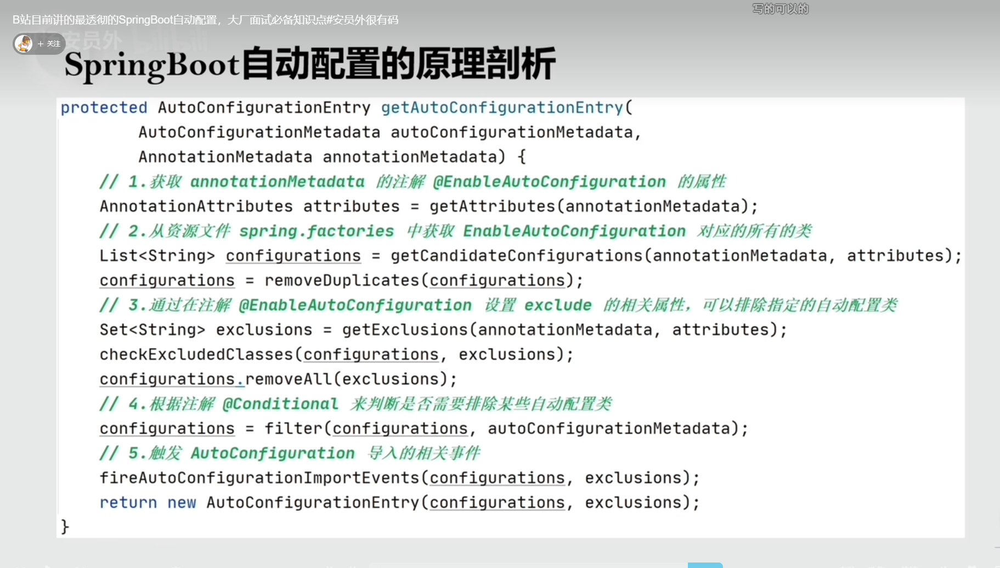
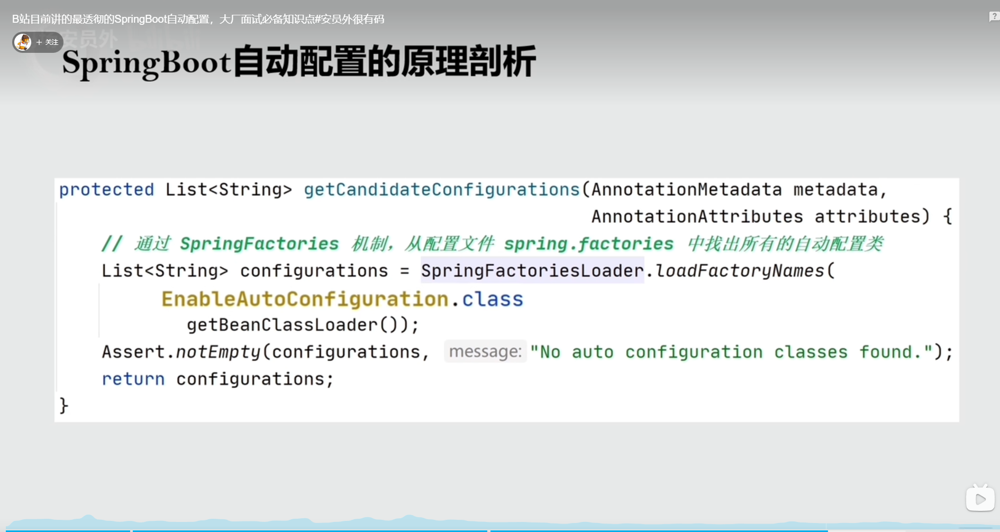
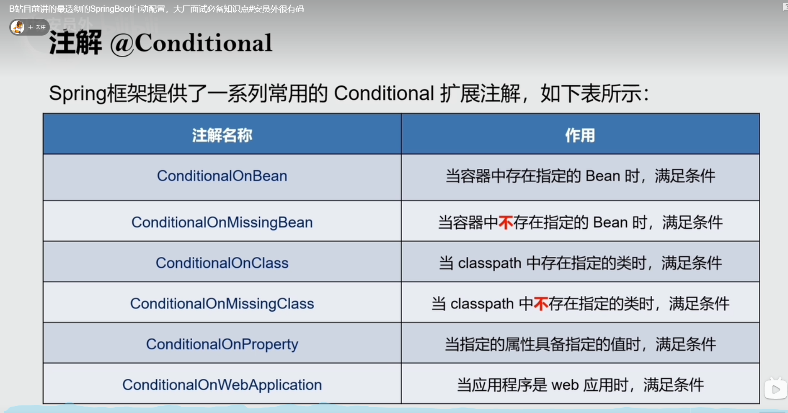
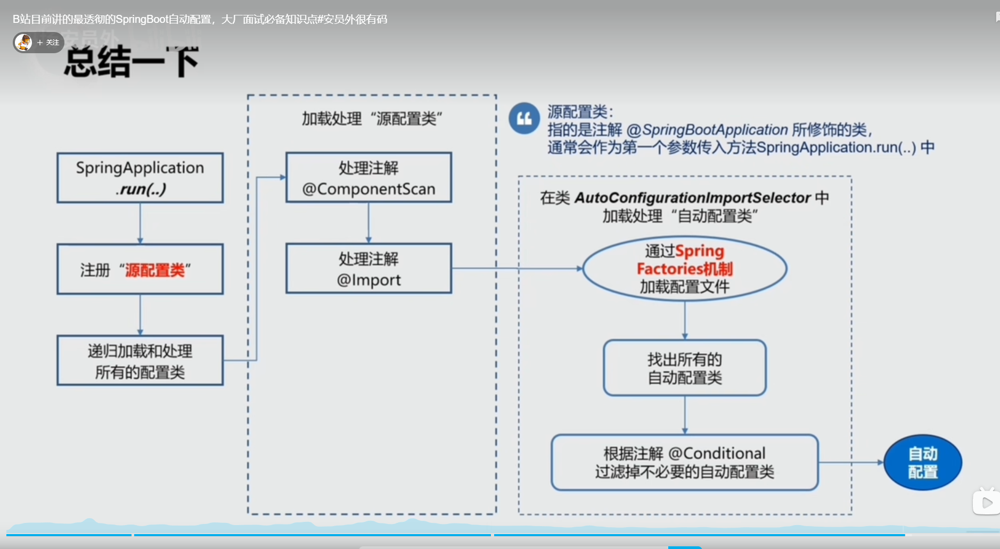
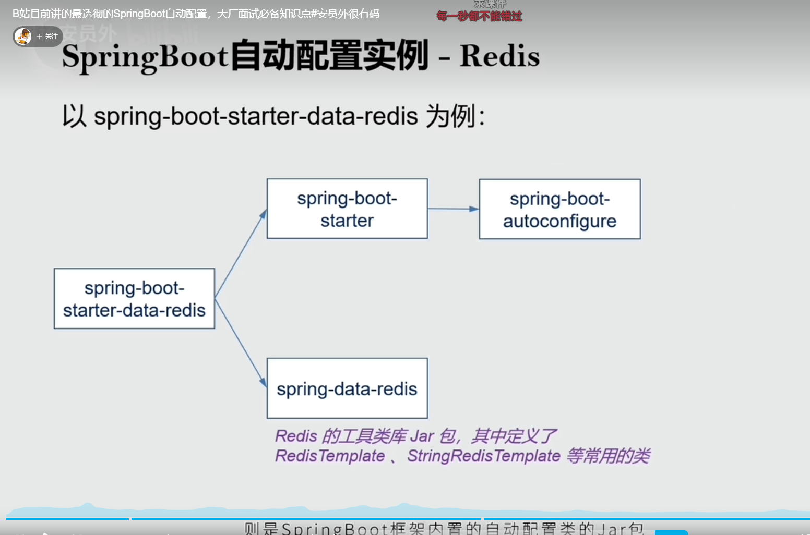
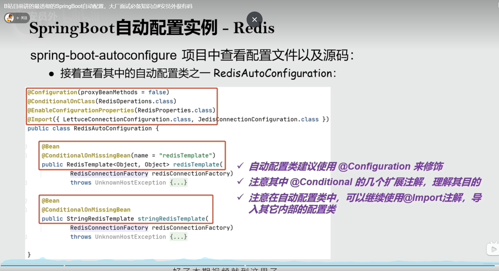

#视频链接 
https://www.bilibili.com/video/BV1NY411P7VX/?spm_id_from=333.788&vd_source=aa5389bcc6b005f1df9bd575bdf94c6e
# 思路梳理
```
视频讲解了使用SpringFactory的机制自动装填容器。这个机制和SPI机制非常像。
可以达到开箱即用的效果。每个子pom(如redis的starter)都依赖了spring-boot-start这个jar包
而这个pom的有spring-boot-autoconfigure这个jar包。这个jar包spring 文件夹下对需要引入的实现类
进行了规定。从而把对应的配置类引入项目（如redis的配置类）,配置类的内部又使用Bean注解或者Import导入
需要的具体类
```    
#视频截图










